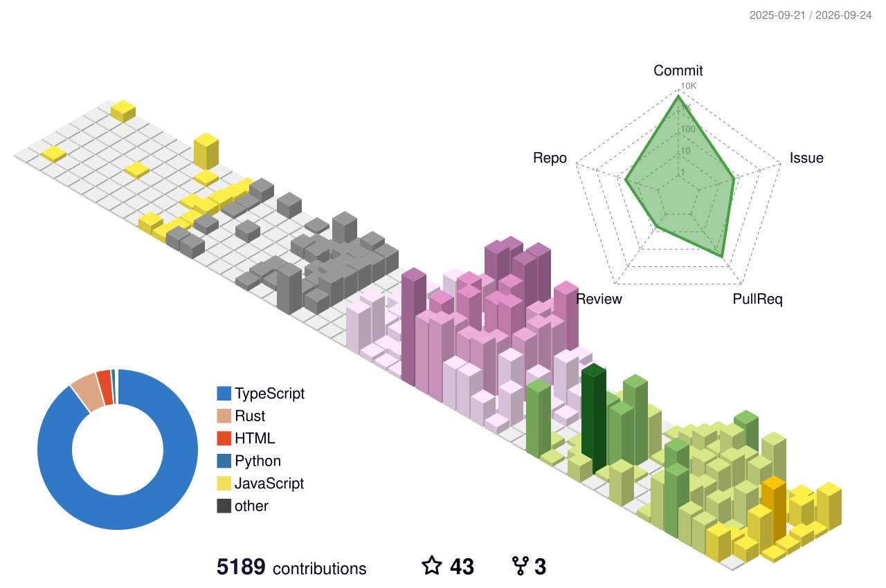

<picture>
  <source media="(prefers-color-scheme: dark)" srcset="https://skillicons.dev/icons?i=ts,rust,java,python,cloudflare,react,nodejs,swift&amp;theme=dark">
  <source media="(prefers-color-scheme: light)" srcset="https://skillicons.dev/icons?i=ts,rust,java,python,cloudflare,react,nodejs,swift&amp;theme=light">
  
</picture>

## Three years, at a glance

**227 merged pull requests** since August 2023 · **167 external PRs** · **20 external repositories**

<picture>
  <source media="(prefers-color-scheme: dark)" srcset="https://github-profile-summary-cards.vercel.app/api/cards/profile-details?username=hrhrng&amp;theme=github_dark">
  <source media="(prefers-color-scheme: light)" srcset="https://github-profile-summary-cards.vercel.app/api/cards/profile-details?username=hrhrng&amp;theme=github">
  
</picture>

## Selected work

| Project | What I worked on | 3Y activity |
| :-- | :-- | --: |
| **[OpenMA](https://github.com/openma-ai/open-managed-agents)** | Managed-agent runtime across Cloudflare Workers, Durable Objects, and Node.js | **2,592** |
| **[Clash](https://github.com/clash-create/clash)** | Local-first creative workspace for agents and humans | **947** |
| **[Backchat](https://github.com/openma-ai/backchat)** | Desktop ACP workspace, releases, packaging, and timeline reliability | **167** |
| **[Martty](https://github.com/openma-ai/Martty)** | Native ACP client, plugin-driven TUI, Linux/macOS distribution | **141** |
| **[Playheads](https://github.com/hrhrng/playheads)** | Music agent spanning LangChain/FastAPI, React, and native SwiftUI | **152** |
| **[DeepSeek Harness ACP](https://github.com/openma-ai/deepseek-harness-acp)** | ACP sessions, plugin/standalone packaging, editor compatibility | **86** |
| **[Readio](https://github.com/hrhrng/readio)** | Terminal reading, local-model narration, images, and accessibility | **62** |

3Y activity = commits + pull requests + issues recorded by GitHub, Aug 2023—Aug 2026.

## Upstream contributions

| Project | Merged work |
| :-- | :-- |
| **[LangChain4j](https://github.com/langchain4j/langchain4j)** | **7 merged PRs** — [structured output](https://github.com/langchain4j/langchain4j/pull/1917), [Milvus fields](https://github.com/langchain4j/langchain4j/pull/1852), [tool execution metadata](https://github.com/langchain4j/langchain4j/pull/1647), Pinecone filters, and provider fixes |
| **[ModelScope EvalScope](https://github.com/modelscope/evalscope)** | Evaluation-framework documentation via [#134](https://github.com/modelscope/evalscope/pull/134) |
| **[Ratatui ecosystem](https://github.com/ratatui/awesome-ratatui)** | Added [Readio](https://github.com/ratatui/awesome-ratatui/pull/395) and [Martty](https://github.com/ratatui/awesome-ratatui/pull/413) to the ecosystem catalog |
| **DeepSeek Harness ecosystem** | Shipped ACP, MCP Apps, and agent-plugin bridges; upstreamed them across community directories |

## Contribution city

<picture>
  <source media="(prefers-color-scheme: dark)" srcset="./profile-3d-contrib/profile-night-rainbow.svg">
  <source media="(prefers-color-scheme: light)" srcset="./profile-3d-contrib/profile-season-animate.svg">
  
</picture>

## Recent activity

## More experiments

`[video]` [remotion-fast](https://hrhrng.github.io/remotion-fast/) ·
`[data]` [super-json](https://hrhrng.github.io/super-json/) ·
`[voice]` [tts-router](https://github.com/hrhrng/tts-router) ·
`[agents]` [gragraf](https://github.com/hrhrng/gragraf)

Time can change me, but I can't trace time.

Visuals powered by
<a href="https://github.com/kyechan99/capsule-render">Capsule Render</a> ·
<a href="https://github.com/DenverCoder1/readme-typing-svg">Typing SVG</a> ·
<a href="https://github.com/lowlighter/metrics">Metrics</a> ·
<a href="https://github.com/yoshi389111/github-profile-3d-contrib">3D Contrib</a> ·
<a href="https://github.com/Ashutosh00710/github-readme-activity-graph">Activity Graph</a>

