# Hi, I am BoAI

### Being Other.

I build open-source infrastructure for managed agents, creative tools, and local-first software.

## Selected work

<table>
<tr>
<td width="50%" valign="top">

### [LangChain4j](https://github.com/langchain4j/langchain4j)

Contributed **7 merged pull requests** across structured output, tool execution metadata, vector-store integrations, and provider support.

`Java` · `LLM applications` · `AI services`

</td>
<td width="50%" valign="top">

### [OpenMA](https://github.com/openma-ai/open-managed-agents)

An open-source managed-agent runtime for Cloudflare Workers, Durable Objects, and Node.js.

`managed agents` · `serverless` · `TypeScript`

</td>
</tr>
<tr>
<td width="50%" valign="top">

### [Playheads](https://github.com/hrhrng/playheads)

A music agent spanning a LangChain/FastAPI backend, React web player, and native SwiftUI app.

`music agent` · `web` · `iOS`

</td>
<td width="50%" valign="top">

### [Clash](https://github.com/clash-create/clash)

A local-first creative workspace where agents and humans build together.

`creative agents` · `canvas` · `desktop`

</td>
</tr>
<tr>
<td width="50%" valign="top">

### [Martty](https://github.com/openma-ai/Martty)

A fast native ACP client and plugin-driven TUI for DeepSeek Harness.

`ACP` · `TUI` · `Rust`

</td>
<td width="50%" valign="top">

### [Backchat](https://github.com/openma-ai/backchat)

A desktop workspace for ACP agents, projects, tools, files, browsers, and sessions.

`agent workspace` · `ACP` · `TypeScript`

</td>
</tr>
<tr>
<td width="50%" valign="top">

### [DeepSeek Harness ACP](https://github.com/openma-ai/deepseek-harness-acp)

An ACP server that brings DeepSeek Harness into compatible editors and clients.

`agent protocol` · `plugins` · `TypeScript`

</td>
<td width="50%" valign="top">

### [Readio](https://github.com/hrhrng/readio)

A tiny terminal reader for EPUB, PDF, Markdown, images, and local-model narration.

`terminal` · `accessibility` · `Rust`

</td>
</tr>
</table>

## Three years of open source

Since August 2023: **227 merged pull requests**, including **167 across 20 repositories outside this account**. The card highlights representative work rather than only the latest activity.

<picture>
  <source media="(prefers-color-scheme: dark)" srcset="./contributions-dark.svg">
  <source media="(prefers-color-scheme: light)" srcset="./contributions.svg">
  
</picture>

Generated with [OpenSource Contribution Card](https://github.com/dbwls99706/OpenSource-contribution-card).

## Small tools

- [remotion-fast](https://hrhrng.github.io/remotion-fast/) — a privacy-first online video editor.
- [super-json](https://hrhrng.github.io/super-json/) — a browser-only JSON viewer and editor.
- [tts-router](https://github.com/hrhrng/tts-router) — a local TTS router built for agents.
- [gragraf](https://github.com/hrhrng/gragraf) — a simple agentic workflow built on LangGraph.

Time can change me, but I can't trace time.

